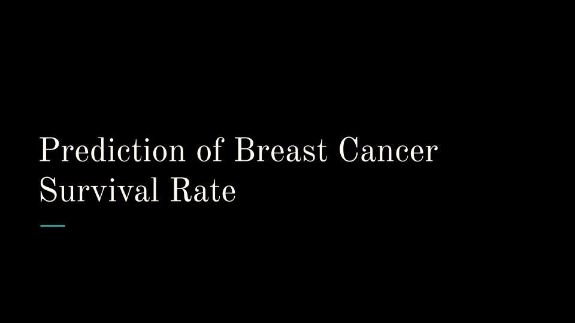
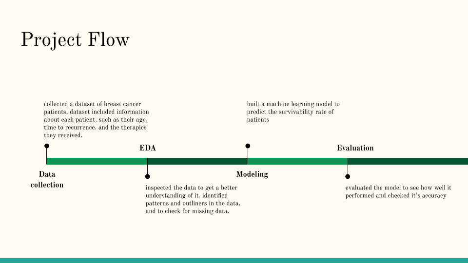
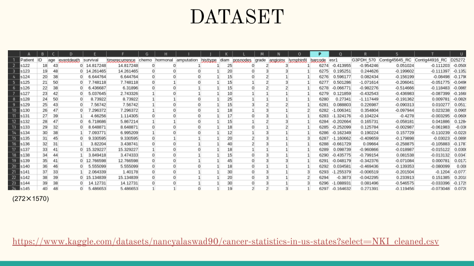
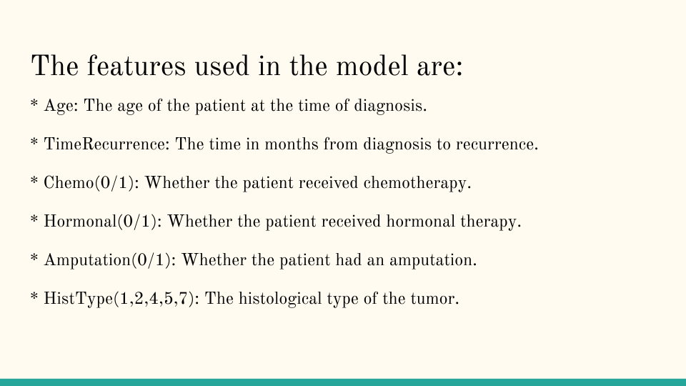
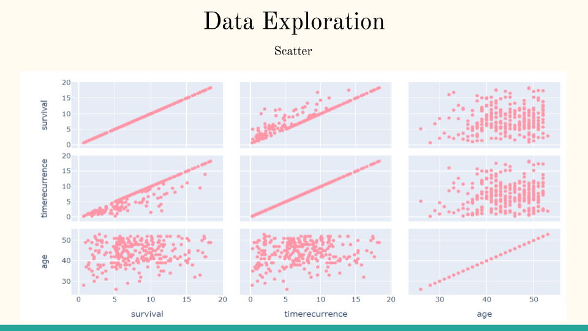
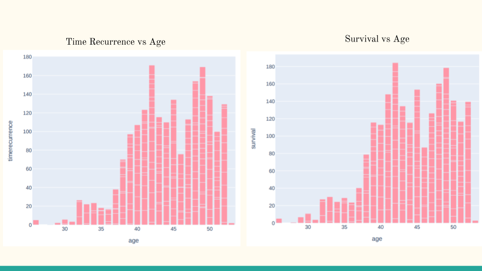
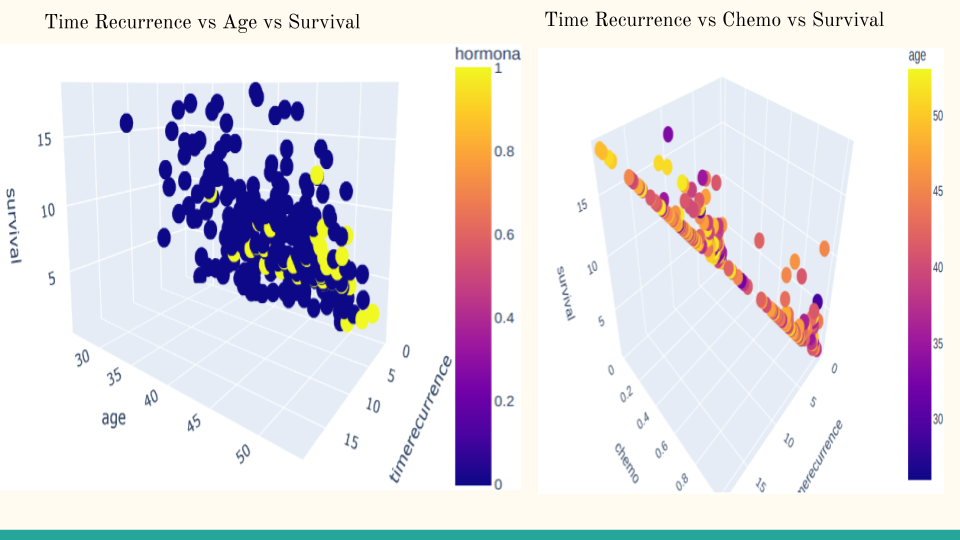
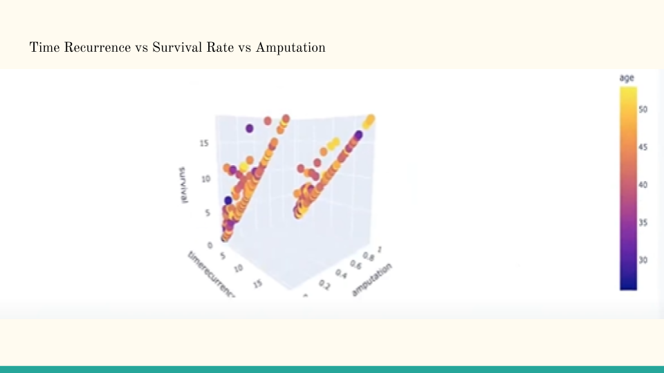
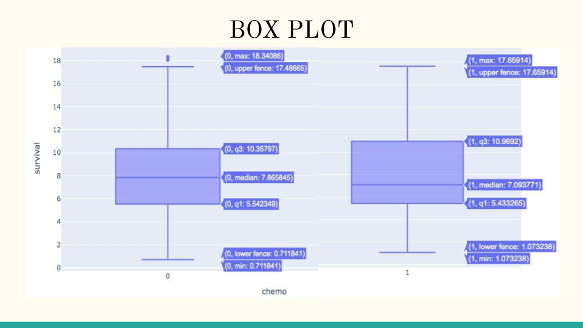
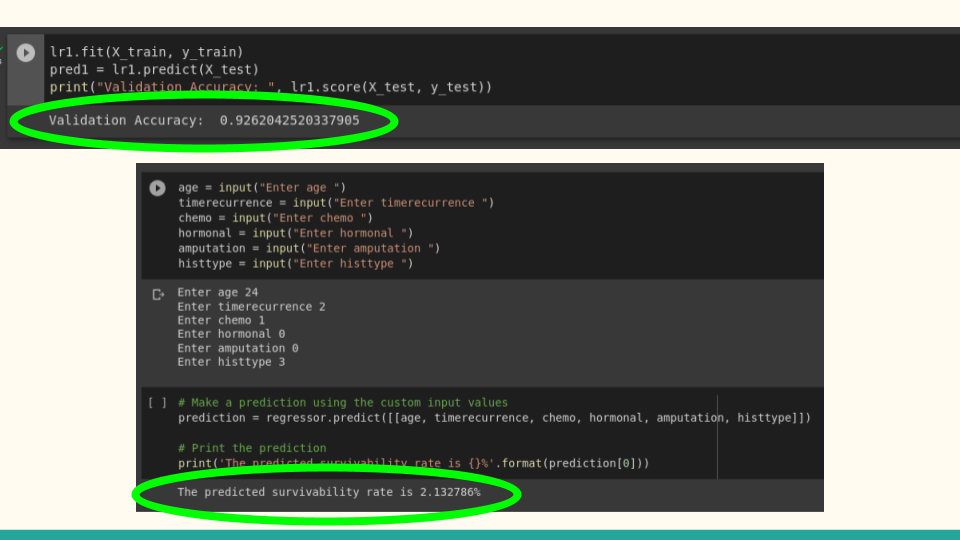

# SurvivorGen
SurvivorGen - Breast Cancer Survival Prediction
Created a cutting-edge bioinformatics prototype leveraging omics data integration to forecast breast cancer survivability rates accurately.
Employed exploratory data analysis to identify key features for predicting survivability and implemented a robust machine-learning model to train the tool.

## Exploratory Data Analysis

## Accuracy
It showed an accuracy of 92.6204% .
20% of the data was used for testing the model.

## Team Members
### Ankit Singh , Kumar Aryan Singh , Ayush Prakash , Prem Kamal Jain , Yogender Yadav
